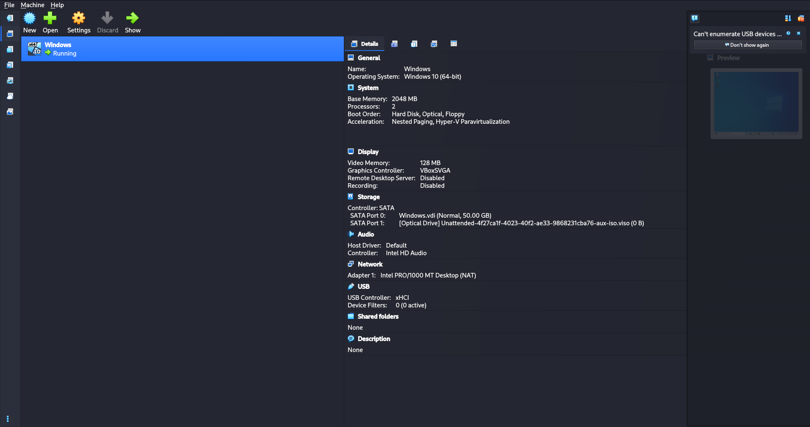
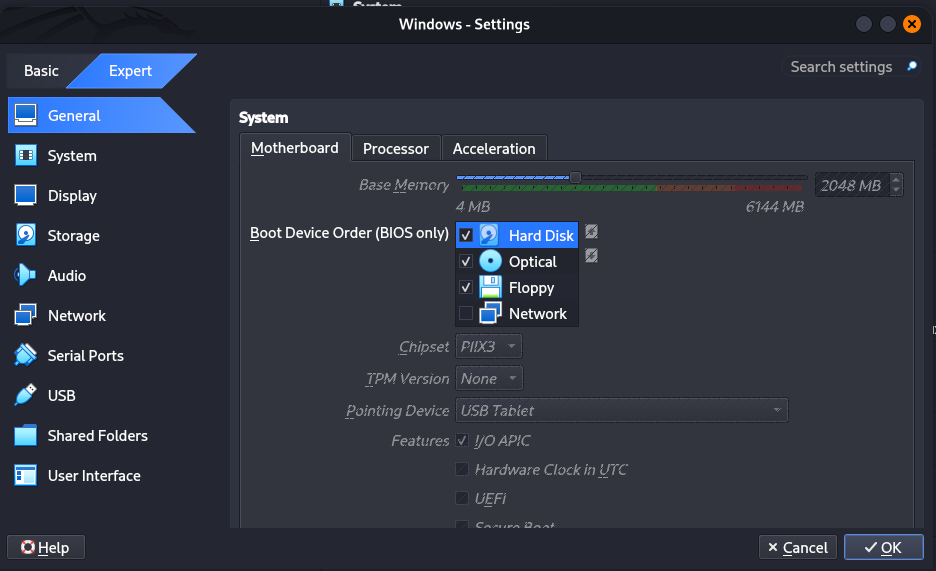
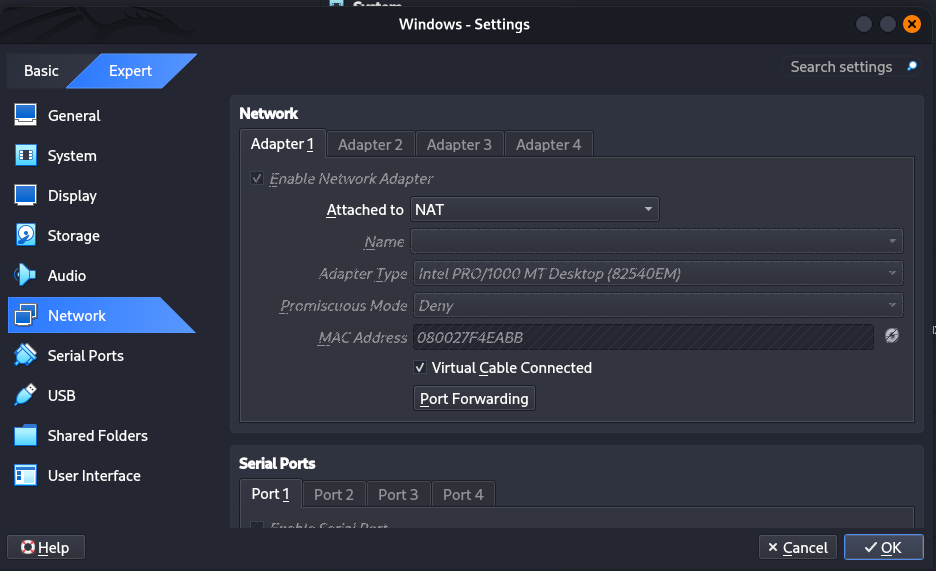
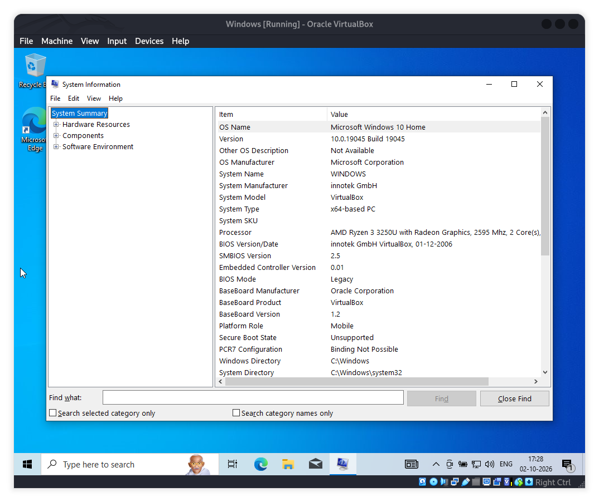
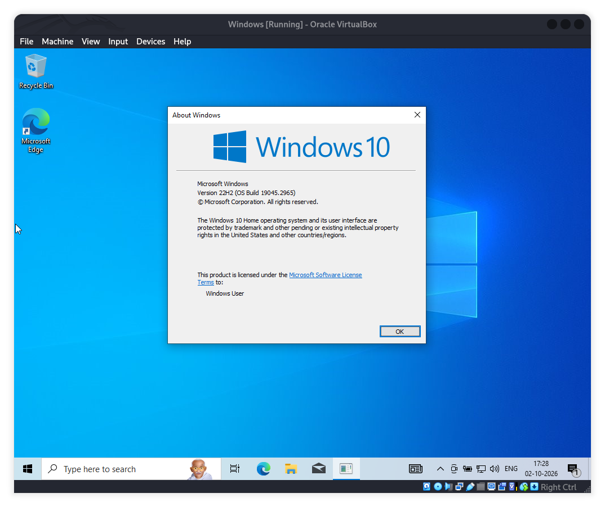
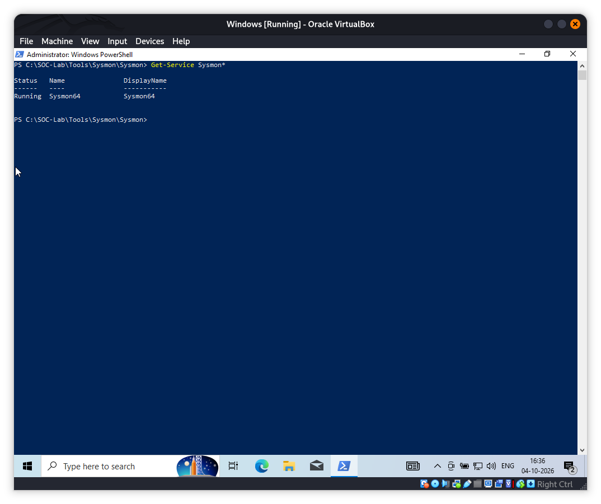
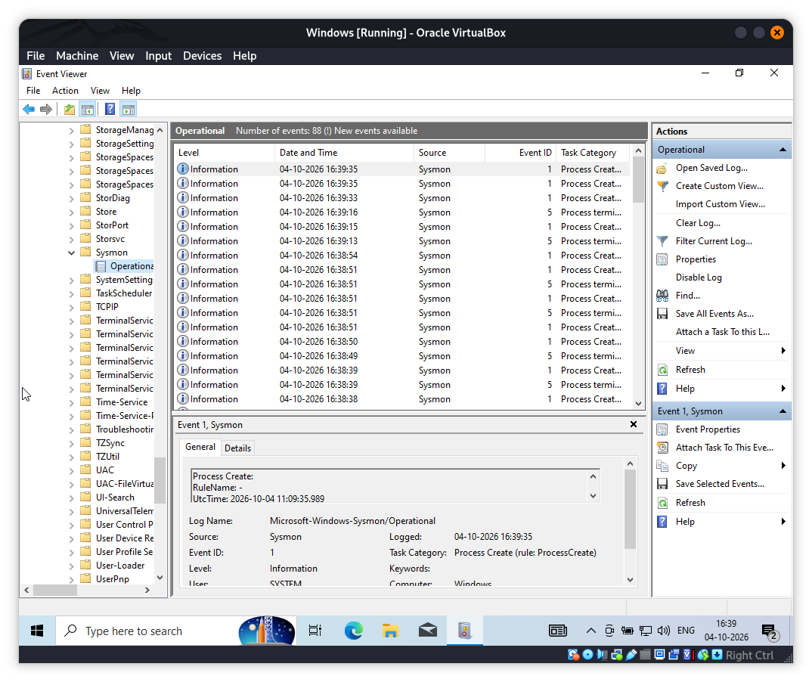

# 🛡️ Windows Endpoint Threat Detection & Investigation Lab

A hands-on Windows endpoint security lab focused on **threat detection, endpoint telemetry analysis, SOC investigation, incident reconstruction, IOC extraction, MITRE ATT&CK mapping, and detection engineering**.

The project is built around controlled activity performed against a Windows 10 virtual machine. The goal is not simply to generate security events, but to understand how an analyst moves from raw telemetry to an evidence-based conclusion.

> **Project Status:** 🚧 In Progress
>
> **Current Phase:** Endpoint Investigation
>
> **Investigation 001:** Authentication investigation completed and documented.

---

## 📌 Project Overview

Endpoint attacks rarely produce a single piece of evidence. A useful investigation requires the analyst to correlate authentication events, process activity, PowerShell execution, file and registry changes, network activity, and SIEM alerts where available.

This lab follows an evidence-first investigation model:

```text
Controlled Activity
        ↓
Telemetry Collection
        ↓
Detection / Event Identification
        ↓
Alert or Event Validation
        ↓
Evidence Correlation
        ↓
Timeline Reconstruction
        ↓
IOC Extraction
        ↓
MITRE ATT&CK Mapping
        ↓
Impact Assessment
        ↓
Containment Recommendations
        ↓
Detection Improvement
```

The project emphasizes **behavioral correlation rather than treating a single event as proof of compromise**.

---

# 🎯 Objectives

The primary objectives are to develop practical skills in:

- Windows Security Event Log analysis
- Sysmon telemetry analysis
- PowerShell investigation
- Process tree analysis
- Authentication investigation
- File and registry investigation
- Persistence analysis
- Network activity analysis
- SIEM alert investigation
- Wazuh monitoring and detection
- IOC extraction
- Timeline reconstruction
- False-positive analysis
- MITRE ATT&CK mapping
- Detection engineering
- SOC incident documentation

---

# 🏗️ Lab Architecture

Kali Linux is the physical host and is used as the controlled test source. Windows 10 runs inside VirtualBox as the endpoint under investigation.

The Windows VM uses NAT for normal connectivity and a VirtualBox Host-Only network for isolated host-to-VM investigation traffic.

```text
                         KALI LINUX HOST
                         192.168.56.1
                                │
                                │ Host-Only Network
                                │
                                ▼
                    ┌─────────────────────────┐
                    │      Windows 10 VM      │
                    │    192.168.56.101       │
                    │                         │
                    │ Windows Event Logs      │
                    │ Sysmon                  │
                    │ PowerShell              │
                    │ Process Explorer        │
                    │ Procmon                 │
                    └────────────┬────────────┘
                                 │
                                 ▼
                    ┌─────────────────────────┐
                    │ Endpoint Investigation  │
                    │                         │
                    │ Event Analysis          │
                    │ Correlation              │
                    │ Timeline Reconstruction │
                    │ IOC Extraction          │
                    │ MITRE ATT&CK Mapping    │
                    └────────────┬────────────┘
                                 │
                                 ▼
                    ┌─────────────────────────┐
                    │    Wazuh Integration    │
                    │      Detection Phase    │
                    └─────────────────────────┘
```

## Current Environment

| Component | Configuration |
|---|---|
| Host OS | Kali Linux |
| Hypervisor | Oracle VirtualBox |
| Endpoint OS | Windows 10 64-bit |
| VM Memory | 3072 MB |
| VM Processors | 2 |
| Virtual Disk | 50 GB |
| Windows NAT IP | 10.0.2.15 |
| Windows Host-Only IP | 192.168.56.101 |
| Kali Host-Only IP | 192.168.56.1 |
| Authentication Test Account | `SOC-LabUser` |
| SMB | TCP/445 |
| Endpoint Telemetry | Windows Event Logs + Sysmon |
| SIEM | Wazuh, later detection phase |

The environment screenshots are stored under `screenshots/00-environment/` and the lab setup evidence is stored under `screenshots/01-lab-setup/`.

---

# 🧰 Tools & Technologies

| Technology | Purpose |
|---|---|
| **Windows Event Logs** | Authentication, process, account and system activity |
| **Sysmon** | Detailed endpoint telemetry |
| **PowerShell** | Endpoint investigation and PowerShell activity analysis |
| **Process Explorer** | Process tree and executable investigation |
| **Procmon** | Real-time file, registry, process and network activity |
| **Kali Linux** | Controlled test source and network investigation tooling |
| **smbclient** | Controlled SMB authentication testing |
| **Wazuh** | SIEM, log collection, alerting and detection engineering |
| **MITRE ATT&CK** | Adversary behavior and technique mapping |

---

# 🖥️ Lab Setup Evidence

The initial endpoint environment has been configured and documented before the investigation phase.

## Environment Screenshots

```text
screenshots/00-environment/
├── 01-virtualbox-overview.png
├── 02-virtualbox-system.png
├── 03-virtualbox-network.png
├── 04-windows-msinfo32.png
└── 05-windows-version.png
```

These screenshots document the VirtualBox environment, system configuration, networking, Windows system information, and Windows version.

## Lab Setup Screenshots

The current Sysmon setup evidence includes:

```text
screenshots/01-lab-setup/
├── 02-sysmon-service-running.png
└── 03-sysmon-operational-log.png
```

These screenshots demonstrate that Sysmon was installed, the Sysmon service was running, and the operational log was producing telemetry.

---

# 🔎 Telemetry Sources

## Windows Security Logs

Important events used throughout the project include:

| Event ID | Activity |
|---:|---|
| 4624 | Successful logon |
| 4625 | Failed logon |
| 4634 | Logoff |
| 4648 | Explicit credential use |
| 4672 | Special privileges assigned |
| 4688 | Process creation |
| 4697 | Service installation |
| 4720 | User account creation |
| 4728 | User added to security-enabled global group |
| 4732 | User added to local security group |
| 7045 | New service installed |
| 1102 | Security audit log cleared |

The purpose is not to memorize Event IDs. The goal is to understand what information each event provides and how it can be correlated with other evidence.

## Sysmon Telemetry

Key Sysmon events used in this project include:

| Sysmon Event | Activity |
|---:|---|
| 1 | Process creation |
| 3 | Network connection |
| 5 | Process termination |
| 7 | Image/DLL loading |
| 8 | CreateRemoteThread |
| 10 | Process access |
| 11 | File creation |
| 12-14 | Registry activity |
| 15 | Alternate Data Stream |
| 22 | DNS query |
| 23 / 26 | File deletion |

A typical investigation may correlate:

```text
Process Creation
      ↓
File Activity
      ↓
Registry Activity
      ↓
DNS Activity
      ↓
Network Connection
```

---

# 🧠 Investigation Methodology

Every investigation follows a consistent SOC workflow.

### 1. Alert / Event Identification

Identify the event or activity that initiated the investigation.

### 2. Validate

Determine whether the activity is:

- Expected
- Suspicious
- Malicious
- False positive
- Insufficient evidence

### 3. Identify

Answer:

```text
Who?
What?
When?
Where?
How?
```

### 4. Correlate

Correlate evidence across:

- Windows Event Logs
- Sysmon
- PowerShell
- Process Explorer
- Procmon
- Wazuh
- Network telemetry

### 5. Reconstruct Process or Authentication Context

For process investigations, examine parent-child relationships.

For authentication investigations, correlate:

```text
Account
   +
Logon Type
   +
Source Address
   +
Timestamp
   +
Event ID
   +
Logon ID where applicable
```

### 6. Build a Timeline

Place relevant events in chronological order and distinguish observed evidence from analyst interpretation.

### 7. Extract IOCs

Potential indicators include:

- IP addresses
- Domains
- URLs
- File hashes
- File names
- File paths
- Registry keys
- User accounts
- Process names
- Command lines

### 8. Map to MITRE ATT&CK

Only map techniques when the observed behavior supports the mapping.

### 9. Assess Impact

Determine whether the evidence demonstrates:

- Code execution
- Persistence
- Privilege escalation
- Credential-related activity
- Discovery
- Network communication
- Potential data access

### 10. Recommend Response

Document appropriate containment, monitoring, eradication, recovery, and detection improvements where supported by the evidence.

---

# 🧪 Completed Investigation

## Investigation 001 - SMB Authentication / Password Guessing Pattern

**Status: Completed**

This investigation was performed against the author's isolated Windows 10 lab VM.

### Objective

Generate a controlled sequence of failed and successful SMB authentication attempts and investigate the resulting Windows Security telemetry.

### Controlled Test

```text
Source:  Kali Linux host
Source IP: 192.168.56.1
Target: Windows 10 VM
Target IP: 192.168.56.101
Protocol: SMB
Port: TCP/445
Account: SOC-LabUser
```

The test sequence consisted of:

```text
Failed authentication #1
        ↓
Failed authentication #2
        ↓
Failed authentication #3
        ↓
Failed authentication #4
        ↓
Failed authentication #5
        ↓
Successful authentication
```

### Observed Telemetry

The investigation identified:

- Five Windows Security Event ID 4625 failures
- One Windows Security Event ID 4624 success
- Target account: `SOC-LabUser`
- Logon Type: `3 (Network)`
- Source address: `192.168.56.1`
- Successful authentication time: `04-10-2026 17:45:25`
- Successful session Logon ID: `0x34a6b4`
- Windows recorded workstation name: `SUHAS`
- The failed events included `0xc000006d` with substatus `0xc000006a`, consistent with invalid credentials in this controlled test

### Reconstructed Timeline

```text
17:44:18  Failed authentication
17:45:01  Failed authentication
17:45:04  Failed authentication
17:45:07  Failed authentication
17:45:11  Failed authentication
17:45:25  Successful authentication
```

### Investigation Finding

Five failed network authentication attempts against `SOC-LabUser` were followed by a successful Type 3 network authentication from the same controlled source IP, `192.168.56.1`.

This supports a **controlled password-guessing pattern** in the lab environment.

The investigation does **not** demonstrate post-authentication command execution, persistence, privilege escalation, data access, or exfiltration because no such activity was performed or observed during this case.

### MITRE ATT&CK

The observed repeated authentication failures are relevant to:

- **T1110 - Brute Force**
- More specifically, the controlled behavior is consistent with **T1110.001 - Password Guessing**

The mapping is based on the deliberately generated sequence of incorrect passwords followed by a successful authentication.

### IOC Context

`192.168.56.1` is recorded as an investigation artifact and source address, not as a malicious external IOC. It belongs to the isolated VirtualBox Host-Only lab network.

`SOC-LabUser` is a lab account created specifically for the investigation.

### Investigation Report

The detailed investigation materials are maintained under:

```text
investigations/001-authentication-investigation/
```

The final incident report is maintained under:

```text
reports/incident-reports/INC-001-SMB-Authentication-Attack.md
```

---

# 🧪 Planned Investigations

## Investigation 002 - PowerShell Investigation

A controlled PowerShell execution case will examine:

- PowerShell process creation
- Sysmon Event ID 1
- Parent process
- Child processes
- Command line
- User context
- File activity
- Network activity where present

Key questions:

- What launched PowerShell?
- What command was executed?
- Which user executed it?
- What child processes were created?
- Were files created or modified?
- Did related network activity occur?
- Does the complete process chain provide suspicious context?

## Investigation 003 - File Execution Investigation

A controlled file creation and execution case will examine:

- Sysmon Event ID 11
- Sysmon Event ID 1
- Process tree
- File path
- User context
- Command line
- Related network activity

Key questions:

- Which process created the file?
- Where was the file created?
- Was it subsequently executed?
- Which process executed it?
- What parent-child relationship was observed?
- What IOCs can be extracted?
- Which ATT&CK techniques are supported?

---

# 🔮 Future Investigation Scenarios

Additional scenarios may include:

### Scenario 04 - Persistence

Controlled investigation of mechanisms such as:

- Registry Run Keys
- Scheduled Tasks
- Windows Services
- Startup locations

### Scenario 05 - Suspicious Service Creation

Investigation using:

- Windows Event ID 7045
- Sysmon process telemetry
- Process Explorer
- File activity

### Scenario 06 - Suspicious File Activity

Investigation of a process that creates or modifies executable content.

### Scenario 07 - Defense Evasion

Controlled examples involving behaviors such as:

- Security log clearing
- File deletion
- Suspicious PowerShell activity
- Process masquerading concepts

These are planned scenarios. They are not presented as completed investigations until the corresponding activity is actually generated and analyzed.

---

# 🧬 MITRE ATT&CK Mapping

Potential mappings used by future investigations include:

| Behavior | Technique |
|---|---|
| Password guessing | T1110.001 |
| PowerShell | T1059.001 |
| Windows Command Shell | T1059.003 |
| Scheduled Task / Job | T1053.005 |
| Windows Service | T1543.003 |
| Registry Run Keys / Startup Folder | T1547.001 |
| Masquerading | T1036 |

Mappings will be based on observed behavior and supporting evidence rather than automatically assigning a technique to every event.

---

# 🚨 Detection & Investigation Philosophy

> **A suspicious event is not automatically a confirmed compromise.**

For example, `powershell.exe` alone does not establish malicious activity.

The investigation should consider:

```text
Parent Process
      +
Command Line
      +
User
      +
File Activity
      +
Registry Activity
      +
Network Activity
      +
Timing
      +
Context
      ↓
Analyst Conclusion
```

Similarly, repeated authentication failures should be evaluated in context. Account, source address, logon type, timestamps, authentication result, and subsequent activity all matter.

---

# 🧹 False Positive Analysis

Every significant detection should be evaluated for alternative explanations.

```text
Detection
   ↓
Evidence
   ↓
Expected administrative activity?
   ↓
Known software behavior?
   ↓
Suspicious context?
   ↓
Related activity?
   ↓
Analyst conclusion
```

Possible outcomes include:

```text
True Positive
False Positive
Benign / Expected Activity
Insufficient Evidence
```

---

# 📊 IOC Extraction

Each completed investigation should maintain its own IOC record under its investigation directory and contribute validated indicators to the central IOC index.

```text
investigations/<investigation>/iocs.md
              ↓
       validated indicators
              ↓
 iocs/extracted-iocs.md
```

Potential IOC categories include:

- IP address
- Domain
- URL
- Hash
- File name
- File path
- Registry key
- User account
- Process
- Command line

Placeholder values must never be presented as actual findings.

---

# 📁 Repository Structure

The repository separates attack generation, investigation, evidence, detection engineering, and reporting.

```text
Windows-Endpoint-Threat-Detection-Investigation-Lab/
│
├── README.md
│
├── architecture/
│   └── architecture.md
│
├── setup/
│   ├── windows/
│   ├── sysmon/
│   ├── powershell/
│   └── wazuh/
│
├── scenarios/
│   ├── 001-authentication/
│   ├── 002-powershell/
│   ├── 003-file-execution/
│   ├── 004-persistence/
│   ├── 005-service-creation/
│   ├── 006-file-activity/
│   └── 007-defense-evasion/
│
├── investigations/
│   ├── 001-authentication-investigation/
│   │   ├── README.md
│   │   ├── analysis.md
│   │   ├── timeline.md
│   │   ├── iocs.md
│   │   ├── mitre-mapping.md
│   │   └── findings.md
│   ├── 002-powershell-investigation/
│   └── 003-file-execution/
│
├── detections/
│   └── wazuh-rules/
│
├── iocs/
│   └── extracted-iocs.md
│
├── mitre/
│   └── attack-mapping.md
│
├── reports/
│   ├── incident-reports/
│   │   └── INC-001-SMB-Authentication-Attack.md
│   └── executive-summary.md
│
└── screenshots/
    ├── 00-environment/
    │   ├── 01-virtualbox-overview.png
    │   ├── 02-virtualbox-system.png
    │   ├── 03-virtualbox-network.png
    │   ├── 04-windows-msinfo32.png
    │   └── 05-windows-version.png
    │
    ├── 01-lab-setup/
    │   ├── 02-sysmon-service-running.png
    │   └── 03-sysmon-operational-log.png
    │
    ├── 001-authentication/
    ├── 002-powershell/
    └── 003-file-execution/
```

## Lab Environment

### VirtualBox Environment







### Windows Environment






## Sysmon Deployment

### Sysmon Service Running



### Sysmon Operational Log



### Directory Responsibilities

| Directory | Purpose |
|---|---|
| `setup/` | Documents how the endpoint and security tooling were configured |
| `scenarios/` | Documents how controlled test activity was generated |
| `investigations/` | Contains analyst evidence, analysis, timelines, IOCs, and findings |
| `screenshots/` | Stores visual evidence captured during setup and investigations |
| `detections/` | Contains tested Wazuh detection logic and tuning |
| `iocs/` | Central index of validated indicators extracted from investigations |
| `mitre/` | Central ATT&CK mapping across completed investigations |
| `reports/` | Final incident reports and project-level executive summary |

---

# 📚 Skills Demonstrated

This project demonstrates practical capability in:

- Windows Security Event Log analysis
- Sysmon investigation
- Endpoint telemetry analysis
- Process tree analysis
- PowerShell investigation
- Authentication monitoring
- File and registry investigation
- Persistence analysis
- Network activity analysis
- SIEM investigation
- Wazuh
- IOC extraction
- Timeline reconstruction
- False-positive analysis
- MITRE ATT&CK
- Detection engineering
- Incident response documentation

---

# 🔐 Security & Ethical Use

This project is intended for **defensive cybersecurity education and authorized laboratory use only**.

All attack-like activity is performed against systems owned or explicitly authorized for testing.

The Host-Only network is used to isolate controlled investigation traffic between the Kali host and Windows VM.

No unauthorized systems, accounts, networks, or data should be targeted.

---

# ⚠️ Project Limitations

This is an educational home-lab environment and should not be interpreted as a production-grade EDR or SOC platform.

Detection and investigation quality depends on:

- Logging configuration
- Sysmon configuration
- Wazuh rules
- Endpoint configuration
- Available telemetry
- Investigation context

The project documents only activity that was actually generated and observed. Planned scenarios are clearly separated from completed investigations.

A single alert or event should not automatically be treated as proof of compromise.

---

# 🚀 Project Roadmap

```text
[✓] Windows endpoint preparation
[✓] VirtualBox environment configuration
[✓] Windows system/version documentation
[✓] Sysmon deployment
[✓] Sysmon telemetry validation
[✓] Host-Only investigation network
[✓] Controlled SMB authentication scenario
[✓] Investigation 001 - Authentication
[✓] 4625 failed authentication analysis
[✓] 4624 successful authentication analysis
[✓] Timeline reconstruction for Investigation 001
[✓] IOC documentation for Investigation 001
[✓] MITRE ATT&CK mapping for Investigation 001
[✓] Incident report for Investigation 001
[ ] Investigation 002 - PowerShell
[ ] Investigation 003 - File Execution
[ ] Process Explorer investigation
[ ] Procmon investigation
[ ] File activity investigation
[ ] Registry investigation
[ ] Persistence investigation
[ ] Network telemetry investigation
[ ] Wazuh agent integration
[ ] Wazuh detection rules
[ ] Additional controlled investigation scenarios
[ ] Alert triage through Wazuh
[ ] Detection tuning
[ ] Final investigation summary
```

---

# 🎓 Learning Outcome

By completing this project, the analyst should be able to move through the following workflow independently:

```text
Generate Controlled Activity
          ↓
Understand the Expected Telemetry
          ↓
Identify Relevant Events
          ↓
Validate the Evidence
          ↓
Correlate Events
          ↓
Build a Timeline
          ↓
Extract IOCs
          ↓
Map ATT&CK Techniques
          ↓
Assess Impact
          ↓
Write an Incident Report
          ↓
Improve Detection
```

The final objective is not simply to operate security tools. It is to demonstrate the reasoning required to turn endpoint telemetry into a defensible SOC investigation.
